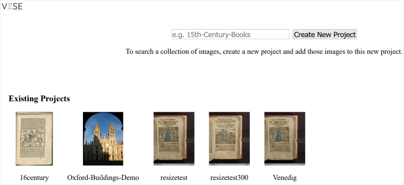
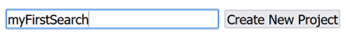
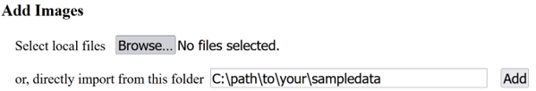
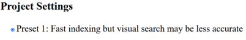

# Installation VISE

## Prerequisites

- Internet connection
- This information is mainly aimed at installations on Windows and Mac systems

- On linux systems install from source or as docker image (might take a while)
- In case of docker run with:
  ```
  docker run -d -p <local port>:9669 -v <local data folder>:/opt/vise/data/ ubuntu/vise:latest
  ```

## Steps and commands
- Go to website and download for your system: https://www.robots.ox.ac.uk/~vgg/software/vise/ 
- Install on your system
- Start application by opening http://localhost:9669 in your browser



# Usage

## Create search engine with sample data

- Download sample data: !!link!!
- Unzip sample data
- Create project (name of your choice)

  
- Add Images: point to your unzipped sample data

  
- Project Settings: Preset 1 (keep unchanged for this exercise)

  
- Create Visual Search Engine (will take a few minutes)

## Basic search usage

- Select your created image search
- Select an image to query on
- Optional: Draw region of interest
- Search results
- Results list can be extended by clicking on show-button (twice)
- To learn more about the matches between two images, click on image in result list

## Usage for automated search

### search query
VISE receives search parameter as url parameters. You can utilize this for automatic search requests by using the following parameters:
- x: x coordinate of upper left corner of roi
- y: y coordinate of upper left corner of roi
- width: width of roi
- height: height of roi
- file_id: internal file id
example query URL: `http://localhost:9669/16century/search?x=21&y=50&width=216&height=290&file_id=4`

### getting data as json
- generally, information can be retrieved as json data by appending `response_format=json` to the URL parameters. This works for the endpoints `filelist`, `file` and `search`.

### Response format for search

Search results are returned in the following data model:

```
{
    "PNAME":"projectname",
    "QUERY":{
        "file_id":4,
        "filename":"queryfilename.jpg",
        "x":23,
        "y":50,
        "width":217,
        "height":290
    },
    "RESULT_SIZE":89,
    "RESULT":[
        {
            "file_id":4,
            "filename":"queryfilename.jpg",
            "score":704.009,
            "H":[1,0,0,0,1,0,0,0,1]
        },
        {
            "file_id":52,
            "filename":"resultfile.jpg",
            "score":117.001,
            "H":[1.06999,0,29.2417,-0.0103714,1.00576,-16.5996,0,0,1]
        },
    ...
}
```
Remarks:
- The first result normally is the query file itself as a best match. Therefore, this first file also determines the max inlier score reachable with that search query
- Search result areas are provided by means of the transformation matrix that has to be applied to the query region (`QUERY.x`, ...) to get the matching region. (For the first result this normally is the identity matrix because the source and target of the transformation are identical)